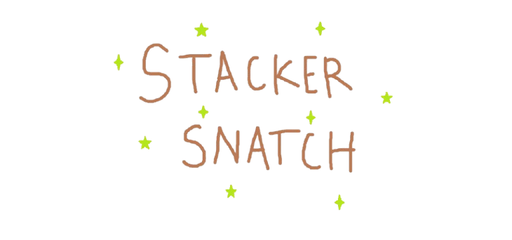

<p align="center">
  
</p>

## 🕹 Gamified Stack Battle Simulator
<br/>

<p align="center">
  
</p>

## 🤷🏻‍♀️ What's this about even?

Theory of Automata (CS3005) was a course offered to me as part of my Comp. Sci. Bachelor's degree during my 4th semester.
We were tasked with creating both a hardware and a software project to highlight how well we'd retained the topics we'd 
covered in class. 

Among the many options offered for the software task, this one stood out to me the most - it challenged me to take my 
understanding of Pushdown Automata (PDA) and turn it into something genuinely useful (and fun!) for other students who 
might be struggling with the topic.

This was also my *first-ever react project*, so I dove headfirst into learning it while building this simulation from 
scratch.

My goal was to help players see how a PDA works, using a game-like interface to make the concept easier to understand and
way more engaging.

<br/>

## 👾 Features:

- [ ] Interactive Stack Visualization
- [ ] Puzzle Levels Increasing in Difficulty [_in progress_]
- [ ] Leaderboard & Scoring System

<br/>

## 😿 Note to self (and anyone reading):

**This is a project that was definitely rushed** and could use a bit of repolishing - juggling other assignments and 
deadlines made it harder to finish everything I had envisioned, I'll admit :c <br/>

So yes, **it is incomplete**, for now! It's missing an ε-transition level that I was meaning to add but was unable to do
so due to the strict time constraint.

<br/>

## 🛠 How to run this app locally

### 📦 requirements
- node.js (v18+ recommended)
- npm (comes with node)

> ❗❗ if you don’t have node installed, get it here 👉🏻 https://nodejs.org

<br/>

1. **clone the repo**
```
git clone https://github.com/your-username/stackersnatch.git
cd stackersnatch
```

2. **install dependencies**
```
npm install
```

3. **start the dev server**
```
npm start
```

<br/>

---

## 👩🏻‍💻 For anyone wanting to recreate something similar:

These repos really proved to be helpful for me during the learning/research process. Hope they help you out, too!

- [PDA Simulation Web Tool](https://github.com/Chaphasilor/automata)
- [PDA Visual Sandbox](https://github.com/cheezypotatoes/Deterministic-PushDown-Automata-Project)

Happy PDA-simulating :D and best of luck, I know I needed it 😿.<br/>
Also would love to see how you modify this! 😸🧡


---

## 📜 License & credits

**Copyright © 2025 b2lie**

Font: Mojangles by [Liam Butler (SpiffyKids)](https://fontstruct.com/fontstructors/1463562/spiffykids) - Licensed under [CC BY-NC 3.0](https://creativecommons.org/licenses/by-nc/3.0/)

This program is free software:  you can redistribute it and/or modify it under the terms of the [GNU General Public License](https://www.gnu.org/licenses/gpl-3.0.html)
as published by the Free Software Foundation, either version 3 of the License, or (at your option) any later version.

---

### 🎨 Artwork credits

**Cup Nooble** – *[Sprout Lands Asset Pack](https://cupnooble.itch.io/sprout-lands-asset-pack)*